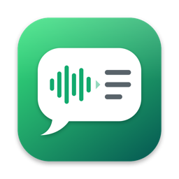

# Opus Lite



**Audio, video and documents. All to text.**

A native macOS app that turns WhatsApp voice notes, audio, video, PDFs and images into text — entirely on your Mac. Built with SwiftUI and the system speech and vision frameworks. No bundled models, no dependencies: the whole app is about 1.3 MB.

[](https://github.com/glozahn/Opus-lite/releases/latest)    

[Download Opus Lite](https://github.com/glozahn/Opus-lite/releases/latest) · [Build from source](#build-from-source) · [Engines](#engines) · [Shortcuts](#shortcuts) · [Privacy](#privacy)

## Drop it in, read it back

Drag files or whole folders onto the window, use **Import** (⌘O), right-click a file in Finder and choose *Open With ▸ Opus Lite*, or **Record** a voice note from the microphone (⇧⌘N). New files are transcribed automatically, one after another.

| You drop | Opus Lite does |
| --- | --- |
| WhatsApp voice notes (`.opus`, `.ogg`) | Decodes them natively and transcribes them — no conversion step. |
| Any audio (`.m4a`, `.mp3`, `.wav`, …) | Transcribes it with timestamps. |
| Video (`.mp4`, `.mov`, …) | Extracts the audio track and transcribes it. |
| PDF | Uses the text layer, or reads scanned pages with OCR, page by page. |
| Images | Reads the text with OCR. |

A one-minute voice note is transcribed in under a second (about 100× real time on Apple silicon).

## A library, not a file picker

- **Three columns**: Library (All Files, Recent, Favorites, In Progress, Trash), your files, and the selected transcript, plus an **Options** inspector (⌥⌘I).
- **Queue with status** for every file: progress percentage, *Waiting*, *Error* with one-click retry.
- **Search** file names and transcripts at once (⌘F); matches are highlighted in the text.
- **Favorites and Trash**. Removing from the library never deletes your original files.
- Everything is saved between launches.

## Read, listen, edit

- **Transcript** split into paragraphs with **timestamps**. Click a timestamp to play from there; the paragraph being spoken is highlighted as the audio plays.
- **Subtitles** tab with timed cues, ready to export.
- **Player** with a waveform you can click or drag to seek, ±15 s, playback speed and volume (⌥ Space to play or pause).
- **Edit** the text (*··· ▸ Edit Text*) without losing timings.
- For PDFs the text is grouped by page; for images and PDFs a preview replaces the player.

## Export

**Copy** the text (⇧⌘C) or **Export** (⌘E) to:

| Format | Use |
| --- | --- |
| TXT | Plain text, with or without timestamps. |
| DOCX | A Word document. |
| Markdown | Notes and wikis. |
| SRT | Subtitles for video editors and players. |
| VTT | Subtitles for the web. |

Select several files to export them all to a folder, one file each.

## Engines

All engines run on your Mac and use models that ship with macOS, so they add nothing to the app's size and work offline. Choose one in *Options* or *Settings ▸ Models*.

| Engine | When to use it |
| --- | --- |
| **SpeechAnalyzer** | Default. The fastest and most accurate. |
| **Dictation** | The system dictation model, with good punctuation. |
| **Classic SFSpeech** | The previous recognizer, kept as a fallback. |
| **Vision OCR** | PDFs and images (used automatically). |

Pick the transcription language in *Options*; it starts with your system language. Each language model downloads once, the first time you use it, and *Settings ▸ Models* shows what is installed.

Speaker identification and automatic language detection are not included: macOS has no on-device API for them.

## Settings

- **General**: appearance (System, Light, Dark — also the sun/moon switch in the toolbar), **app language** (System, English, Español), transcribe on import, timestamps, default export format.
- **Models**: default engine and per-language model downloads.
- **Privacy**: permission status and where your data lives.
- **Shortcuts** and **About**.

The interface is available in **English** and **Spanish**. By default it follows the macOS language; change it in *Settings ▸ General ▸ Language*.

## Shortcuts

| Action | Shortcut |
| --- | :---: |
| Import files | ⌘O |
| Record a voice note | ⇧⌘N |
| Transcribe selection | ⌘R |
| Stop the queue | ⌘. |
| Export | ⌘E |
| Copy text | ⇧⌘C |
| Play / pause | ⌥ Space |
| Search | ⌘F |
| Show or hide Options | ⌥⌘I |
| Move to Trash | ⌘⌫ |
| Settings | ⌘, |

## Privacy

Opus Lite sends no audio, text or analytics anywhere. Transcription uses the macOS speech frameworks and OCR uses Vision, both on device. The library and your recordings live in `~/Library/Application Support/OpusLite/`; audio extracted from videos is cached in `~/Library/Caches/OpusLite/`.

The app asks for the microphone only when you record, and for speech recognition only if you use the classic SFSpeech engine.

## Build from source

Requires macOS 26 and Xcode 26 (Swift 6) on Apple silicon.

```bash
git clone https://github.com/glozahn/Opus-lite.git
cd Opus-lite
./build.sh
open "build/Opus Lite.app"
```

`build.sh` compiles a release build with Swift Package Manager and assembles the app bundle — no Xcode project needed. Copy the app to `/Applications` to keep it.

| Path | Contents |
| --- | --- |
| `Sources/OpusLite/` | App, library and queue, transcription engines, media and OCR, export. |
| `Sources/OpusLite/Views/` | SwiftUI views. |
| `Resources/` | `Info.plist`, app icon, and `en.lproj` / `es.lproj` localizations. |
| `Tools/make_icon.sh` | Redraws the app icon. |

### Adding a language

Interface strings are written in English in the code. Copy `Resources/es.lproj/Localizable.strings` to a new `xx.lproj` folder, translate the values, and add the language code to `CFBundleLocalizations` in `Info.plist`.
